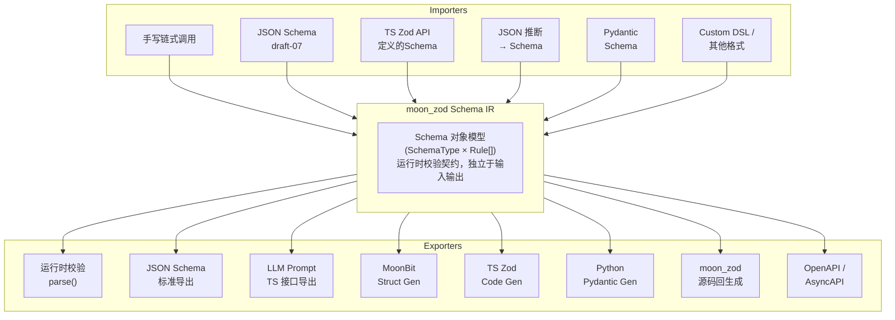
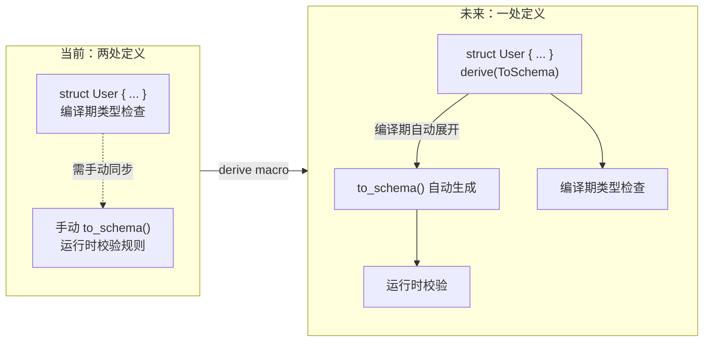

# 设计文档

## 定位：Schema IR

moon_zod 的核心定位是 **运行时 Schema 中间表示（IR）**——一个独立于输入来源和输出目标的校验契约层。它不像传统校验库那样绑定到特定的数据格式定义方式，而是在前端导入与后端导出之间建立了一个统一的 Schema 对象模型。



## 核心价值：解耦

- **输入无关**：无论 Schema 来源于手写代码、JSON 推断、标准 JSON Schema 还是未来的派生宏，最终都归约为统一的 `Schema` 对象
- **输出可扩展**：同一个 Schema 对象可以导出为 JSON Schema、LLM Prompt、MoonBit 结构体或 moon_zod 源码，新增导出器无需修改校验逻辑
- **作为契约桥梁**：只需要定义某种格式到 Schema 的导入器，就能自然地借助 moon_zod 的导出器将其转换为其他各种格式，形成一个**跨语言、跨生态的 Schema 互操作桥梁**

## 目标定位

| 维度 | 定位 |
|------|------|
| **生态角色** | MoonBit 生态中的**基础校验设施**，对标 TypeScript 生态的 Zod / Python 生态的 Pydantic |
| **核心场景** | **LLM Tool Calling** 的结构化输出校验，兼顾通用 JSON 校验 |
| **能力边界** | 运行时动态校验（parse）、多格式导出（Export）、多源导入（Import）、代码生成（Code Gen） |
| **非目标** | 不取代 MoonBit 编译期类型系统；不做异步校验；不做 ORM / 序列化框架 |

---

## 当前架构概览

### 1. parse 路由 + 可变路径栈

```
Schema::parse(json)                   ← 公共入口，创建 path_stack
  └─ parse_inner(schema, json, stack) ← 内部转发枢纽（非 pub）
       ├─ parse_object()              ← push/pop 字段名
       ├─ parse_array()               ← push/pop [索引]
       ├─ parse_optional()            ← 直接传递 stack
       ├─ parse_default()             ← 直接传递 stack
       ├─ parse_transform()           ← 先校验 inner，再应用变换
       ├─ parse_enum()                ← format_path 后报错
       ├─ parse_union()               ← 直接传递 stack
       ├─ parse_intersection()        ← 直接传递 stack，合并对象字段
       └─ 基本类型检查                ← format_path 后报错
```

路径栈 (`Array[String]`) 在所有 parse helper 间共享，进入子结构 `push` / 返回 `let _ = pop()`。仅在产生 `ValidationError` 时调用 `format_path(stack)` 拼接字符串。**成功路径零堆分配**。

### 2. append_rule — 装饰器穿透

```
pub fn append_rule(schema, check, message) -> Schema {
  match schema.schema_type {
    OptionalType(inner)  => 递归到 inner，新建 OptionalType 包裹
    DefaultType(inner,_) => 递归到 inner，新建 DefaultType 包裹
    _ => 直接追加到 rules
  }
}
```

使 `string().optional().min(3)` 的 `min(3)` 规则穿透 OptionalType 落在 StringType 上。`description` 在穿透时正确保留。

### 3. Strip 默认模式

`object()` 默认 `Strip` 模式。parse 成功后只返回 spec 定义的字段（已递归校验清洗的值），未定义字段静默移除。嵌套对象递归剥离。

### 4. Schema 组合器 — pick / omit / partial

- `pick(keys)` — 按 key 列表过滤 Object spec，保留 mode / rules / description
- `omit(keys)` — 排除指定 key
- `partial()` — 将所有字段包裹在 `OptionalType` 中

均保持原 schema 的 object mode（Strip/Passthrough/Strict）。

---

## 未来方向：派生宏（Derive Macro）

当前 moon_zod 要求用户通过链式 API 手写 Schema 定义。这在动态性上提供了最大灵活度，但也意味着需要维护两份定义——MoonBit 结构体类型 + 对应的 runtime Schema。

库中已有的 `schema_to_moonbit_struct_full()` 可以从 Schema 反向生成结构体定义和静态 `Type::to_schema()` 方法，但方向是从 Schema 到结构体。未来期许是通过 MoonBit 的 derive 宏机制，**从结构体定义直接派生 Schema**，实现"一处定义，两处使用"——这是对现有 `to_schema()` 模式的编译期派生升级。

### 预期书写方式

```mbt
///|
/// 定义结构体，同时通过 derive(ToSchema) 自动生成
/// 对应的 moon_zod schema，连接静态类型与运行时校验。
/// 注意：本语法为预期设计，不代表最终语法支持。
/// 待 MoonBit 正式支持 derive macro 后重新设计实现。
struct User {
    #[zod(min = 1)]
    #[zod(pattern = "^[a-zA-Z0-9_]+$")]
    id: String

    #[zod(min = 3)]
    #[zod(max = 20)]
    name: String
} derive(ToSchema)
```

### 期望展开结果

```mbt
///|
/// compile 期自动展开，等效于手写：
pub fn User::to_schema() -> @moon_zod.Schema {
    @moon_zod.object({
        "id": @moon_zod.string().min(1).pattern("^[a-zA-Z0-9_]+$"),
        "name": @moon_zod.string().min(3).max(20),
    })
}
```

### 价值



> **前置条件**：derive macro 依赖 MoonBit 编译器对宏机制的支持。待 MoonBit 正式提供 derive macro 能力后即可实现，当前以链式 API 手写和反向代码生成为主。

这将是 moon_zod 从"好用的校验库"进化为 **MoonBit 生态的 Schema 基础设施**的关键一步——用户只需关心结构体定义和约束注解，Schema 的生成、校验、导出全部自动完成。

---

## 参考

- [Zod](https://zod.dev/) — TypeScript 版参考 API
- [Pydantic](https://docs.pydantic.dev/) — Python 版参考
- MoonBit core `@json` 包 — 了解当前 JSON 类型系统
